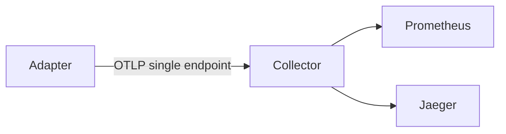
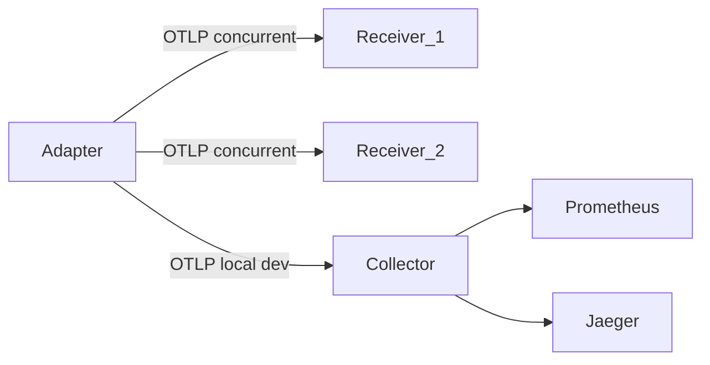

# Beckn Network Observability – Implementation Requirements

## Table of Contents

1. [Purpose and audience](#purpose-and-audience)
2. [Scope](#scope)
3. [Requirements format](#requirements-format)
4. [Requirements by spec area](#requirements-by-spec-area)
5. [Expected results summary](#expected-results-summary)
6. [Priority or phases](#priority-or-phases)
7. [Architecture](#architecture)
8. [File conventions](#file-conventions)

---

## Purpose and audience

**Audience:** Developers implementing or reviewing observability in the Onix adapter, OTEL collector, and related configuration.

**Purpose:** Align Onix telemetry (export) with the **Beckn Network Observability Specification** so events are valid for Network Operator Receivers and downstream analytics. This document is the single source of requirements for that implementation.

**Reference:** The official Beckn Network Observability Specification (and any addendum for Beckn-specific OTel semantic conventions) should be consulted for full event structures and attribute definitions. This doc references spec section names and key attributes only.

---

## Scope

**In scope**

- Adapter-side export: resource attributes, scope, API spans, METRIC events, AUDIT logs
- OTLP configuration (endpoints, batch, compression)
- Dual-receiver support (multiple endpoints, concurrent push, failure isolation)
- Optional collector pipeline changes (e.g. logs pipeline)

**Out of scope (for this document)**

- Implementing the **Network Operator’s Receiver API** (e.g. `POST /v1/telemetry`). The spec defines that Receiver; it is a separate service. This document focuses on the **participant (Onix) export side** only.

---

## Requirements format

Each requirement uses a consistent block so implementers and QA can trace and verify:

- **Requirement ID** – Short, unique tag (e.g. REQ-RES-001) for traceability in issues and PRs.
- **Requirement** – One clear "MUST" or "SHOULD" statement.
- **Current state** – One line on what exists today (file or area).
- **Expected result** – Testable outcome (config, OTLP payload, or UI).
- **Implementation notes / References** – Key files, spec attribute names, or mapping rules (e.g. `traceId = context.transaction_id`).

---

## Requirements by spec area

### 4.1 Entity context (resource attributes)

| ID | Requirement | Expected result |
|----|-------------|-----------------|
| REQ-RES-001 | Resource MUST include `eid` (API / METRIC / AUDIT). | OTLP resource has `eid` = "API", "METRIC", or "AUDIT" per pipeline. |
| REQ-RES-002 | Resource MUST include `producer` (Beckn Subscriber ID). | Value = subscriber_id (e.g. context.bap_id or context.bpp_id / handler SubscriberID). |
| REQ-RES-003 | Resource MUST include `producerType`. | Value = "BAP" or "BPP" from handler role. |

**Current state:** [pkg/plugin/implementation/otelsetup/otelsetup.go](pkg/plugin/implementation/otelsetup/otelsetup.go) sets resource with `service.name`, `service.version`, `environment`, `domain`, `device_id`, `eid`; no `producer` or `producerType`.

**References:** Spec "Entity Context" section; [pkg/model/model.go](pkg/model/model.go) (`model.Role` for bap/bpp).

---

### 4.2 Transport context (scope)

| ID | Requirement | Expected result |
|----|-------------|-----------------|
| REQ-SCP-001 | Scope SHOULD include name and version (e.g. subscriber_id and spec version). | `scope.name` and `scope.version` present where scope is used. |
| REQ-SCP-002 | Scope SHOULD support optional scope_uuid, checksum, count for idempotency and completeness. | When batching, scope attributes can carry `scope_uuid`, `checksum`, `count`. |

**Current state:** No scope attributes set per spec.

**References:** Spec "Transport Context" and "Benefits of Sending Transport-Level Information".

---

### 4.3 API spans (event data)

| ID | Requirement | Expected result |
|----|-------------|-----------------|
| REQ-SPN-001 | traceId MUST map to Beckn context.transaction_id when present. | Span trace ID equals request context `transaction_id` (e.g. from reqpreprocessor context keys). |
| REQ-SPN-002 | spanId MUST map to Beckn context.message_id when present. | Span span ID equals request context `message_id`. |
| REQ-SPN-003 | parentSpanId SHOULD map to context.parent_id when present (cascaded transactions). | Optional parent span ID set from `parent_id`. |
| REQ-SPN-004 | Span MUST include required attributes: span_uuid, sender.id, recipient.id, http.request.method, http.route, http.response.status_code. | All listed attributes present on API spans; sender/recipient from bap_id/bpp_id per spec mapping. |
| REQ-SPN-005 | Span SHOULD include optional: observedTimeUnixNano, server.address, user_agent.original. | Optional attributes set when data available. |

**Current state:** [core/module/handler/stdHandler.go](core/module/handler/stdHandler.go) starts span with OTel default IDs; no Beckn-specific span attributes. Context has `transaction_id`, `message_id` via [config/onix/adapter.yaml](config/onix/adapter.yaml) `contextKeys` and [pkg/plugin/implementation/reqpreprocessor/reqpreprocessor.go](pkg/plugin/implementation/reqpreprocessor/reqpreprocessor.go).

**References:** Spec "API (Spans)", "Key Attributes" (traceId/spanId/sender.id/recipient.id mapping). [pkg/model/model.go](pkg/model/model.go) (`ContextKeyTxnID`, `ContextKeyMsgID`).

---

### 4.4 METRIC events (business/operational metrics)

| ID | Requirement | Expected result |
|----|-------------|-----------------|
| REQ-MET-001 | METRIC events MUST follow spec structure: metric name, unit, sum (or gauge), dataPoints with metric_uuid, metric.code, metric.granularity, metric.frequency, observedTimeUnixNano. | Exported metrics conform to spec METRIC envelope (e.g. search_api_total_count, avg_api_response_time, search_api_failure_percent style). |
| REQ-MET-002 | metric.category and addlData.* SHOULD be supported where applicable. | Optional attributes present for discovery/network health etc. |

**Current state:** [pkg/telemetry/pluginMetrics.go](pkg/telemetry/pluginMetrics.go), [core/module/handler/http_metric.go](core/module/handler/http_metric.go) expose internal Onix metrics (step, plugin, HTTP); not spec METRIC envelope.

**References:** Spec "METRIC" section and example (search_api_total_count, avg_api_response_time, search_api_failure_percent).

---

### 4.5 AUDIT logs

| ID | Requirement | Expected result |
|----|-------------|-----------------|
| REQ-LOG-001 | Adapter MUST be able to export AUDIT log records via OTLP (logRecords). | Log exporter configured; AUDIT events (e.g. state changes, transaction logs) emitted as OTLP logs with traceId/spanId/body/attributes. |
| REQ-LOG-002 | Log records MUST include timeUnixNano, body (stringValue), and required attributes per spec. | Structure matches spec "AUDIT Logs". |
| REQ-LOG-003 | Collector MUST have a logs pipeline (OTLP logs in, export to backend or debug). | [network_observability/otel-collector/config.yaml](network_observability/otel-collector/config.yaml) includes a logs pipeline. |

**Current state:** No OTLP logs in adapter; collector has only metrics and traces pipelines.

**References:** Spec "AUDIT Logs"; OTLP log exporter in Go (e.g. otel export package).

---

### 4.6 Dual receivers

| ID | Requirement | Expected result |
|----|-------------|-----------------|
| REQ-REC-001 | Exporter config MUST support multiple OTLP endpoints (e.g. Network Operator + optional second). | Config (e.g. [config/onix/adapter.yaml](config/onix/adapter.yaml) or otelsetup) allows list of endpoints. |
| REQ-REC-002 | Export MUST push to all configured receivers concurrently. | No sequential dependency; one failure does not block others. |
| REQ-REC-003 | Failure to one receiver MUST NOT prevent export to others. | Isolated per-receiver error handling (e.g. best-effort per endpoint). |

**Current state:** Single `otlpEndpoint` in [config/onix/adapter.yaml](config/onix/adapter.yaml) and otelsetup.

**References:** Spec "Support for Two Receivers", "Execution" and "Failure Handling".

---

### 4.7 Configuration and operational

| ID | Requirement | Expected result |
|----|-------------|-----------------|
| REQ-CFG-001 | Batch/cadence SHOULD be configurable (batch size, flush interval, max wait, retries). | Document or config options for batch size (e.g. 100), flush interval (e.g. 60s), safety flush (e.g. 5 min), retry/backoff. |
| REQ-CFG-002 | OTLP export SHOULD support gzip compression when sending to Receiver. | Client can send compressed payloads where Receiver expects gzip. |

**References:** Spec "Log shipping cadence", "Compression of payloads (gzip)".

---

## Expected results summary

Use this as an acceptance checklist when implementation is complete:

- **Resource:** All telemetry has resource attributes `eid`, `producer`, `producerType`.
- **Scope:** Scope name/version and optional `scope_uuid`/`checksum`/`count` supported.
- **API spans:** traceId/spanId from Beckn context; required span attributes (sender.id, recipient.id, http.*, span_uuid) present.
- **METRIC:** At least one METRIC-style metric (spec envelope) exported with required attributes.
- **AUDIT:** OTLP logs pipeline in collector; adapter can emit AUDIT log records.
- **Dual receivers:** Config has multiple endpoints; export is concurrent and failure-isolated per receiver.
- **Config:** Batch/cadence and compression documented or configurable.

---

## Priority or phases

| Priority | Description | Requirement IDs |
|----------|-------------|-----------------|
| P0 (must-have) | Entity context and core API spans and dual receivers | REQ-RES-001, REQ-RES-002, REQ-RES-003, REQ-SPN-001, REQ-SPN-002, REQ-SPN-004, REQ-REC-001, REQ-REC-002, REQ-REC-003 |
| P1 (should-have) | Scope, optional span attributes, METRIC envelope, AUDIT logs, config | REQ-SCP-001, REQ-SCP-002, REQ-SPN-003, REQ-SPN-005, REQ-MET-001, REQ-MET-002, REQ-LOG-001, REQ-LOG-002, REQ-LOG-003, REQ-CFG-001, REQ-CFG-002 |
| P2 (nice-to-have) | Full METRIC registry coverage, filter/sampling config | As defined by product/ops |

---

## Architecture

**Current:** Adapter exports to a single OTLP endpoint; collector forwards to Prometheus and Jaeger.

**Target:** Adapter exports resource/scope/spans/metrics/logs to multiple OTLP endpoints concurrently; local collector (with logs pipeline) remains available for dev.

---

## File conventions

- Use standard Markdown (headers, tables, code blocks, links to repo files).
- Keep requirement IDs stable so they can be referenced in issues and PRs.
- Link to existing code with relative paths from repo root (e.g. `pkg/plugin/implementation/otelsetup/otelsetup.go`).
- Do not duplicate the full spec; reference section names and key attribute names only.
